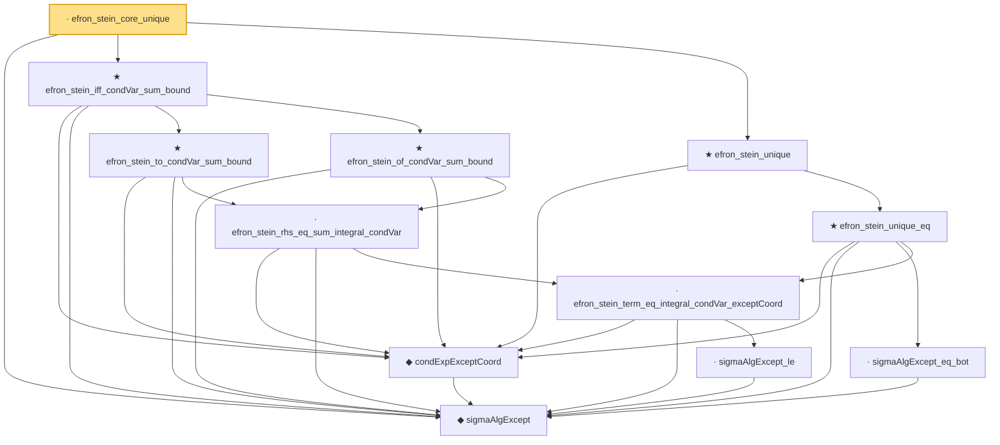

# Proof narrative — efron_stein_core_unique

Root: **efron_stein_core_unique** (lemma) `Statlib/Variance/efron_stein_core_unique.lean:22` · topic `Variance`
Closure: 12 declarations across 12 files. Generated from `proof_graph.json` — no files were moved.

Reading order (foundations first, headline last):

  ◆ `sigmaAlgExcept` — def · `Statlib/Variance/sigmaAlgExcept.lean:20`  _(also used by 13: gaussian_poincare_of_condVar_sum, condExp_eq_fiberAvg_pi, condVar_le_condExp_gradf_sq_ae_succ, …)_
    ◆ `condExpExceptCoord` — def · `Statlib/Variance/condExpExceptCoord.lean:21`  _(also used by 8: gaussian_poincare_of_efron_stein, gaussian_poincare_of_condVar_sum, gaussian_poincare_coord_bound_core, …)_
          · `sigmaAlgExcept_le` — lemma · `Statlib/Variance/sigmaAlgExcept_le.lean:22`  _(also used by 8: condExp_eq_fiberAvg_pi, condVar_le_condExp_gradf_sq_ae_succ, gaussian_poincare_coord_bound_core, …)_
      · `efron_stein_term_eq_integral_condVar_exceptCoord` — lemma · `Statlib/Variance/efron_stein_term_eq_integral_condVar_exceptCoord.lean:22`  _(also used by 1: gaussian_poincare_coord_bound_core)_
      · `efron_stein_rhs_eq_sum_integral_condVar` — lemma · `Statlib/Variance/efron_stein_rhs_eq_sum_integral_condVar.lean:22`
    ★ `efron_stein_to_condVar_sum_bound` — theorem · `Statlib/Variance/efron_stein_to_condVar_sum_bound.lean:22`
    ★ `efron_stein_of_condVar_sum_bound` — theorem · `Statlib/Variance/efron_stein_of_condVar_sum_bound.lean:22`  _(also used by 2: gaussian_poincare_of_condVar_sum, efron_stein)_
  ★ `efron_stein_iff_condVar_sum_bound` — theorem · `Statlib/Variance/efron_stein_iff_condVar_sum_bound.lean:23`
      · `sigmaAlgExcept_eq_bot` — lemma · `Statlib/Variance/sigmaAlgExcept_eq_bot.lean:22`
    ★ `efron_stein_unique_eq` — theorem · `Statlib/Variance/efron_stein_unique_eq.lean:23`
  ★ `efron_stein_unique` — theorem · `Statlib/Variance/efron_stein_unique.lean:21`
· `efron_stein_core_unique` — lemma · `Statlib/Variance/efron_stein_core_unique.lean:22` **← headline**

## Dependency diagram

