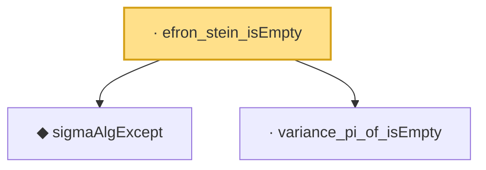

# Proof narrative — efron_stein_isEmpty

Root: **efron_stein_isEmpty** (lemma) `Statlib/Variance/efron_stein_isEmpty.lean:20` · topic `Variance`
Closure: 3 declarations across 3 files. Generated from `proof_graph.json` — no files were moved.

Reading order (foundations first, headline last):

  ◆ `sigmaAlgExcept` — def · `Statlib/Variance/sigmaAlgExcept.lean:20`  _(also used by 22: gaussian_poincare_of_condVar_sum, condExp_eq_fiberAvg_pi, condVar_le_condExp_gradf_sq_ae_succ, …)_
  · `variance_pi_of_isEmpty` — lemma · `Statlib/Variance/variance_pi_of_isEmpty.lean:17`  _(also used by 1: efron_stein_core_gen)_
· `efron_stein_isEmpty` — lemma · `Statlib/Variance/efron_stein_isEmpty.lean:20` **← headline**

## Dependency diagram

