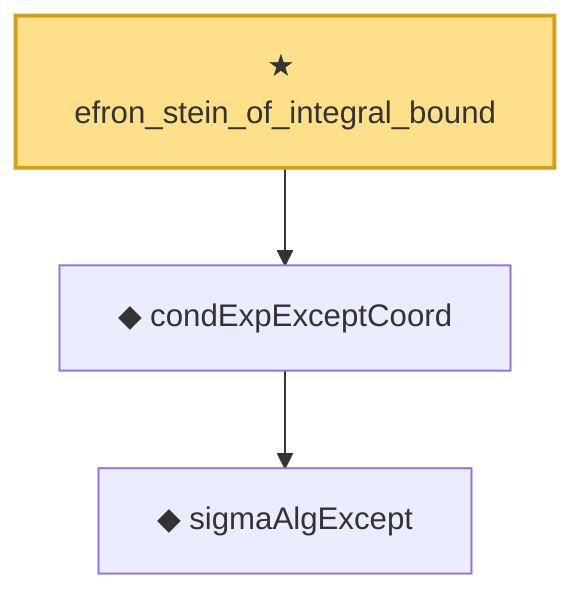

# Proof narrative — efron_stein_of_integral_bound

Root: **efron_stein_of_integral_bound** (theorem) `Statlib/Variance/efron_stein_of_integral_bound.lean:21` · topic `Variance`
Closure: 3 declarations across 3 files. Generated from `proof_graph.json` — no files were moved.

Reading order (foundations first, headline last):

    ◆ `sigmaAlgExcept` — def · `Statlib/Variance/sigmaAlgExcept.lean:20`  _(also used by 22: gaussian_poincare_of_condVar_sum, condExp_eq_fiberAvg_pi, condVar_le_condExp_gradf_sq_ae_succ, …)_
  ◆ `condExpExceptCoord` — def · `Statlib/Variance/condExpExceptCoord.lean:21`  _(also used by 14: gaussian_poincare_of_efron_stein, gaussian_poincare_of_condVar_sum, gaussian_poincare_coord_bound_core, …)_
★ `efron_stein_of_integral_bound` — theorem · `Statlib/Variance/efron_stein_of_integral_bound.lean:21` **← headline**

## Dependency diagram

