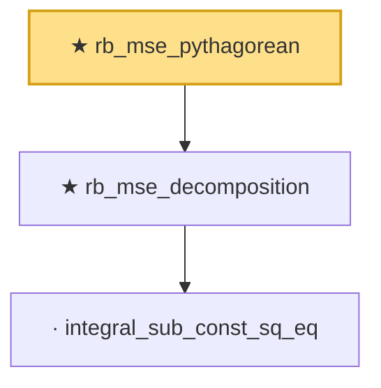

# Proof narrative — rb_mse_pythagorean

Root: **rb_mse_pythagorean** (theorem) `Statlib/Variance/rb_mse_pythagorean.lean:12` · topic `Variance`
Closure: 3 declarations across 3 files. Generated from `proof_graph.json` — no files were moved.

Reading order (foundations first, headline last):

    · `integral_sub_const_sq_eq` — lemma · `Statlib/Variance/integral_sub_const_sq_eq.lean:11`  _(also used by 1: mse_eq_bias_sq_add_variance)_
  ★ `rb_mse_decomposition` — theorem · `Statlib/Variance/rb_mse_decomposition.lean:12`  _(also used by 3: rb_mse_gap_eq_condVar, rb_mse_gap_nonneg, rb_mse_reduction)_
★ `rb_mse_pythagorean` — theorem · `Statlib/Variance/rb_mse_pythagorean.lean:12` **← headline**

## Dependency diagram

