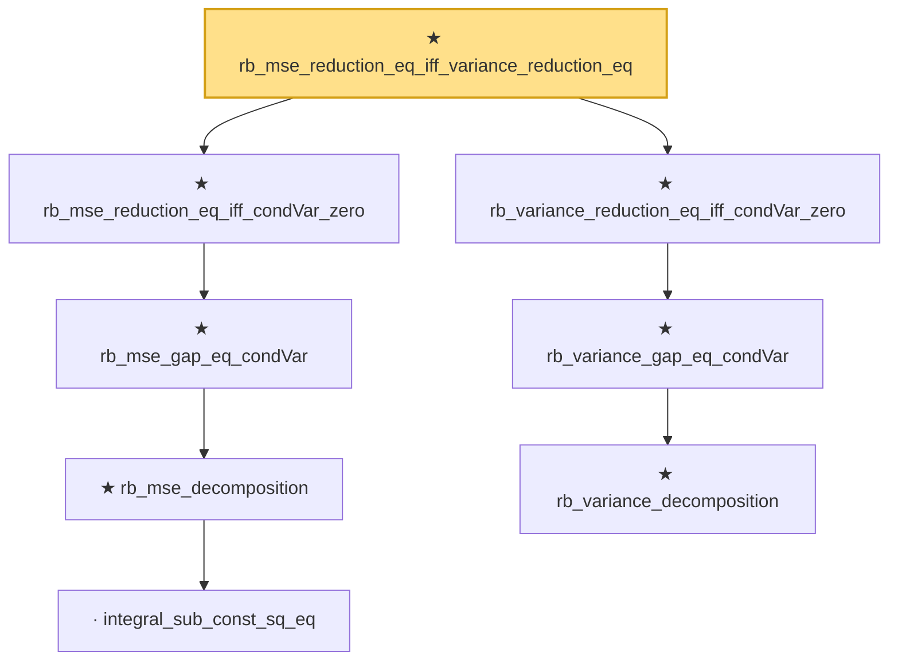

# Proof narrative — rb_mse_reduction_eq_iff_variance_reduction_eq

Root: **rb_mse_reduction_eq_iff_variance_reduction_eq** (theorem) `Statlib/Variance/rb_mse_reduction_eq_iff_variance_reduction_eq.lean:12` · topic `Variance`
Closure: 8 declarations across 8 files. Generated from `proof_graph.json` — no files were moved.

Reading order (foundations first, headline last):

        · `integral_sub_const_sq_eq` — lemma · `Statlib/Variance/integral_sub_const_sq_eq.lean:11`  _(also used by 1: mse_eq_bias_sq_add_variance)_
      ★ `rb_mse_decomposition` — theorem · `Statlib/Variance/rb_mse_decomposition.lean:12`  _(also used by 3: rb_mse_gap_nonneg, rb_mse_pythagorean, rb_mse_reduction)_
    ★ `rb_mse_gap_eq_condVar` — theorem · `Statlib/Variance/rb_mse_gap_eq_condVar.lean:12`
  ★ `rb_mse_reduction_eq_iff_condVar_zero` — theorem · `Statlib/Variance/rb_mse_reduction_eq_iff_condVar_zero.lean:11`
      ★ `rb_variance_decomposition` — theorem · `Statlib/Variance/rb_variance_decomposition.lean:11`  _(also used by 1: rb_variance_reduction)_
    ★ `rb_variance_gap_eq_condVar` — theorem · `Statlib/Variance/rb_variance_gap_eq_condVar.lean:12`  _(also used by 1: rb_variance_gap_nonneg)_
  ★ `rb_variance_reduction_eq_iff_condVar_zero` — theorem · `Statlib/Variance/rb_variance_reduction_eq_iff_condVar_zero.lean:11`  _(also used by 1: condVar_integral_eq_zero_of_stronglyMeasurable)_
★ `rb_mse_reduction_eq_iff_variance_reduction_eq` — theorem · `Statlib/Variance/rb_mse_reduction_eq_iff_variance_reduction_eq.lean:12` **← headline**

## Dependency diagram

