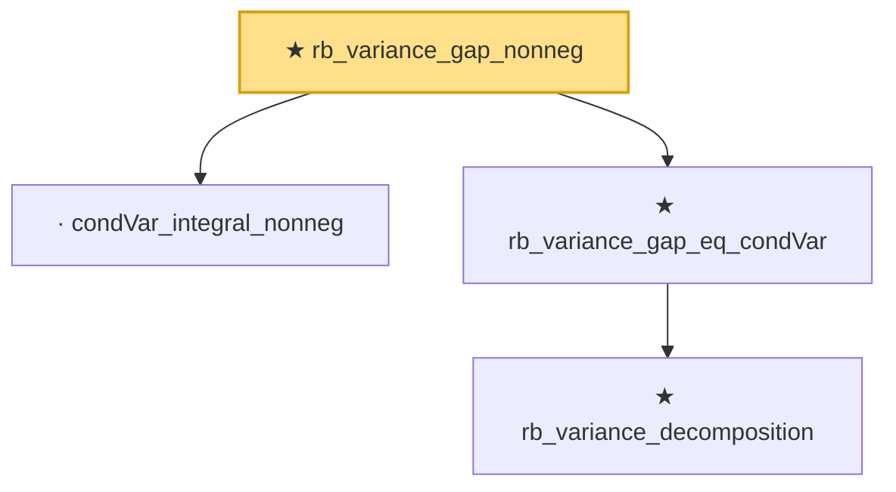

# Proof narrative — rb_variance_gap_nonneg

Root: **rb_variance_gap_nonneg** (theorem) `Statlib/Variance/rb_variance_gap_nonneg.lean:12` · topic `Variance`
Closure: 4 declarations across 4 files. Generated from `proof_graph.json` — no files were moved.

Reading order (foundations first, headline last):

  · `condVar_integral_nonneg` — lemma · `Statlib/Variance/condVar_integral_nonneg.lean:10`  _(also used by 3: rb_mse_gap_nonneg, rb_mse_reduction, rb_variance_reduction)_
    ★ `rb_variance_decomposition` — theorem · `Statlib/Variance/rb_variance_decomposition.lean:11`  _(also used by 1: rb_variance_reduction)_
  ★ `rb_variance_gap_eq_condVar` — theorem · `Statlib/Variance/rb_variance_gap_eq_condVar.lean:12`  _(also used by 1: rb_variance_reduction_eq_iff_condVar_zero)_
★ `rb_variance_gap_nonneg` — theorem · `Statlib/Variance/rb_variance_gap_nonneg.lean:12` **← headline**

## Dependency diagram

