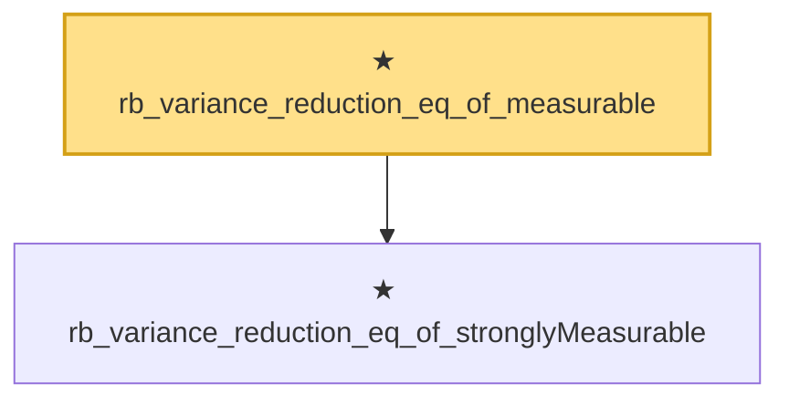

# Proof narrative — rb_variance_reduction_eq_of_measurable

Root: **rb_variance_reduction_eq_of_measurable** (theorem) `Statlib/Variance/rb_variance_reduction_eq_of_measurable.lean:11` · topic `Variance`
Closure: 2 declarations across 2 files. Generated from `proof_graph.json` — no files were moved.

Reading order (foundations first, headline last):

  ★ `rb_variance_reduction_eq_of_stronglyMeasurable` — theorem · `Statlib/Variance/rb_variance_reduction_eq_of_stronglyMeasurable.lean:10`  _(also used by 1: condVar_integral_eq_zero_of_stronglyMeasurable)_
★ `rb_variance_reduction_eq_of_measurable` — theorem · `Statlib/Variance/rb_variance_reduction_eq_of_measurable.lean:11` **← headline**

## Dependency diagram

