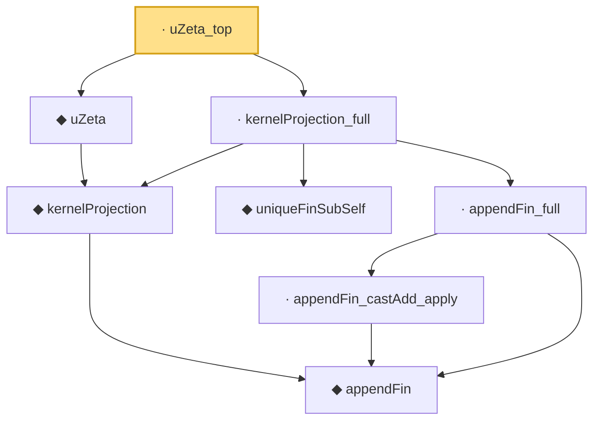

# Proof narrative — uZeta_top

Root: **uZeta_top** (lemma) `Statlib/Variance/uZeta_top.lean:36` · topic `Variance`
Closure: 8 declarations across 8 files. Generated from `proof_graph.json` — no files were moved.

Reading order (foundations first, headline last):

      ◆ `appendFin` — def · `Statlib/Variance/appendFin.lean:34`  _(also used by 8: appendFin_const_measurable, appendFin_measurePreserving, appendFin_natAdd_apply, …)_
    ◆ `kernelProjection` — def · `Statlib/Variance/kernelProjection.lean:35`  _(also used by 14: cov_hSub_eq_uZeta, hajekProjection, hajek_clt, …)_
  ◆ `uZeta` — def · `Statlib/Variance/uZeta.lean:35`  _(also used by 9: cov_hSub_eq_uZeta, hajek_clt, sum_sum_cov_eq, …)_
    ◆ `uniqueFinSubSelf` — def · `Statlib/Variance/uniqueFinSubSelf.lean:34`
      · `appendFin_castAdd_apply` — lemma · `Statlib/Variance/appendFin_castAdd_apply.lean:36`  _(also used by 2: appendFin_const_measurable, appendFin_one_eq_cons_aux)_
    · `appendFin_full` — lemma · `Statlib/Variance/appendFin_full.lean:36`
  · `kernelProjection_full` — lemma · `Statlib/Variance/kernelProjection_full.lean:36`
· `uZeta_top` — lemma · `Statlib/Variance/uZeta_top.lean:36` **← headline**

## Dependency diagram

