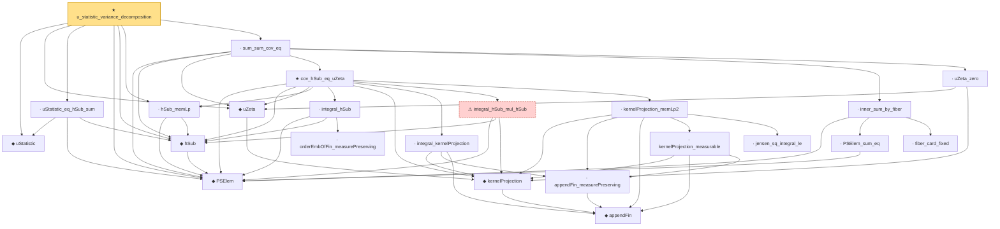

# Proof narrative — u_statistic_variance_decomposition

Root: **u_statistic_variance_decomposition** (theorem) `Statlib/Variance/u_statistic_variance_decomposition.lean:56` · topic `Variance`
Closure: 23 declarations across 23 files. Generated from `proof_graph.json` — no files were moved.

Reading order (foundations first, headline last):

  ◆ `uStatistic` — def · `Statlib/Variance/uStatistic.lean:35`  _(also used by 4: hajek_remainder_var_tendsto_zero, uStatisticCenteredLaw, uStatisticMean, …)_
      ◆ `appendFin` — def · `Statlib/Variance/appendFin.lean:34`  _(also used by 6: appendFin_castAdd_apply, appendFin_const_measurable, appendFin_full, …)_
    ◆ `kernelProjection` — def · `Statlib/Variance/kernelProjection.lean:35`  _(also used by 9: hajekProjection, hajek_clt, integral_h1_eq_kp0_aux, …)_
  ◆ `uZeta` — def · `Statlib/Variance/uZeta.lean:35`  _(also used by 6: hajek_clt, uZeta_nonneg, uZeta_one_eq_var_aux, …)_
  ◆ `PSElem` — abbrev · `Statlib/Variance/PSElem.lean:35`  _(also used by 1: ustatistic_clt_nondegenerate)_
  ◆ `hSub` — def · `Statlib/Variance/hSub.lean:35`
  · `uStatistic_eq_hSub_sum` — lemma · `Statlib/Variance/uStatistic_eq_hSub_sum.lean:38`  _(also used by 1: ustatistic_clt_nondegenerate)_
  · `hSub_memLp` — lemma · `Statlib/Variance/hSub_memLp.lean:39`  _(also used by 1: ustatistic_clt_nondegenerate)_
        · `orderEmbOfFin_measurePreserving` — lemma · `Statlib/Variance/orderEmbOfFin_measurePreserving.lean:35`
      · `integral_hSub` — lemma · `Statlib/Variance/integral_hSub.lean:37`
        · `appendFin_measurePreserving` — lemma · `Statlib/Variance/appendFin_measurePreserving.lean:36`
      · `integral_kernelProjection` — lemma · `Statlib/Variance/integral_kernelProjection.lean:37`
      ⚠ `integral_hSub_mul_hSub` — axiom · `Statlib/Variance/integral_hSub_mul_hSub.lean:57`
        · `kernelProjection_measurable` — lemma · `Statlib/Variance/kernelProjection_measurable.lean:37`
        · `jensen_sq_integral_le` — lemma · `Statlib/Variance/jensen_sq_integral_le.lean:53`
      · `kernelProjection_memLp2` — lemma · `Statlib/Variance/kernelProjection_memLp2.lean:39`
    ★ `cov_hSub_eq_uZeta` — theorem · `Statlib/Variance/cov_hSub_eq_uZeta.lean:46`
      · `PSElem_sum_eq` — lemma · `Statlib/Variance/PSElem_sum_eq.lean:34`
      · `fiber_card_fixed` — lemma · `Statlib/Variance/fiber_card_fixed.lean:33`
    · `inner_sum_by_fiber` — lemma · `Statlib/Variance/inner_sum_by_fiber.lean:36`
    · `uZeta_zero` — lemma · `Statlib/Variance/uZeta_zero.lean:35`
  · `sum_sum_cov_eq` — lemma · `Statlib/Variance/sum_sum_cov_eq.lean:44`
★ `u_statistic_variance_decomposition` — theorem · `Statlib/Variance/u_statistic_variance_decomposition.lean:56` **← headline**

## Dependency diagram

