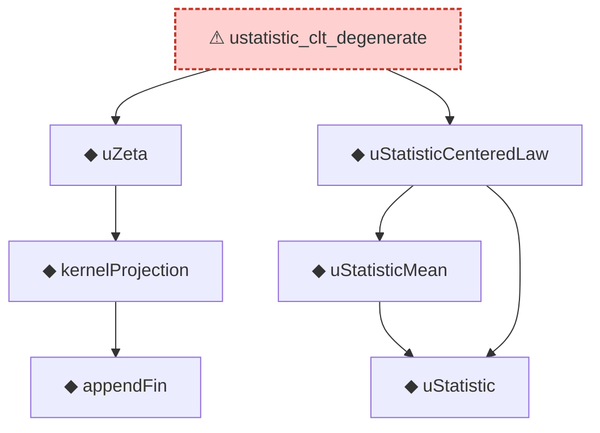

# Proof narrative — ustatistic_clt_degenerate

Root: **ustatistic_clt_degenerate** (axiom) `Statlib/Variance/ustatistic_clt_degenerate.lean:35` · topic `Variance`
Closure: 7 declarations across 7 files. Generated from `proof_graph.json` — no files were moved.

Reading order (foundations first, headline last):

      ◆ `appendFin` — def · `Statlib/Variance/appendFin.lean:34`  _(also used by 10: appendFin_castAdd_apply, appendFin_const_measurable, appendFin_full, …)_
    ◆ `kernelProjection` — def · `Statlib/Variance/kernelProjection.lean:35`  _(also used by 15: cov_hSub_eq_uZeta, hajekProjection, hajek_clt, …)_
  ◆ `uZeta` — def · `Statlib/Variance/uZeta.lean:35`  _(also used by 9: cov_hSub_eq_uZeta, hajek_clt, sum_sum_cov_eq, …)_
    ◆ `uStatistic` — def · `Statlib/Variance/uStatistic.lean:35`  _(also used by 4: hajek_remainder_var_tendsto_zero, uStatistic_eq_hSub_sum, u_statistic_variance_decomposition, …)_
    ◆ `uStatisticMean` — noncomputable def · `Statlib/Variance/uStatisticMean.lean:36`  _(also used by 2: hajek_remainder_var_tendsto_zero, ustatistic_clt_nondegenerate)_
  ◆ `uStatisticCenteredLaw` — noncomputable def · `Statlib/Variance/uStatisticCenteredLaw.lean:38`  _(also used by 1: ustatistic_clt_nondegenerate)_
⚠ `ustatistic_clt_degenerate` — axiom · `Statlib/Variance/ustatistic_clt_degenerate.lean:35` **← headline**

## Dependency diagram

> ⚠ `ustatistic_clt_degenerate` is an **axiom** (no proof body), so its closure only covers declarations referenced in its *statement*. Supporting lemmas in `Variance/` that were meant to prove it are not edge-connected — a signal that the proof line was atomised then axiomatised apart.
