# Proof narrative — ustatistic_clt_nondegenerate

Root: **ustatistic_clt_nondegenerate** (theorem) `Statlib/Variance/ustatistic_clt_nondegenerate.lean:50` · topic `Variance`
Closure: 59 declarations across 59 files. Generated from `proof_graph.json` — no files were moved.

Reading order (foundations first, headline last):

      ◆ `appendFin` — def · `Statlib/Variance/appendFin.lean:34`  _(also used by 5: appendFin_full, appendFin_measurePreserving, integral_kernelProjection, …)_
  ◆ `kernelProjection` — def · `Statlib/Variance/kernelProjection.lean:35`  _(also used by 7: cov_hSub_eq_uZeta, integral_hSub_mul_hSub, integral_kernelProjection, …)_
  ◆ `uZeta` — def · `Statlib/Variance/uZeta.lean:35`  _(also used by 6: cov_hSub_eq_uZeta, sum_sum_cov_eq, uZeta_top, …)_
  ◆ `uStatistic` — def · `Statlib/Variance/uStatistic.lean:35`  _(also used by 1: u_statistic_variance_decomposition)_
  ◆ `uStatisticMean` — noncomputable def · `Statlib/Variance/uStatisticMean.lean:36`
  ◆ `uStatisticCenteredLaw` — noncomputable def · `Statlib/Variance/uStatisticCenteredLaw.lean:38`  _(also used by 1: ustatistic_clt_degenerate)_
  · `uZeta_nonneg` — lemma · `Statlib/Variance/uZeta_nonneg.lean:33`
        · `appendFin_castAdd_apply` — lemma · `Statlib/Variance/appendFin_castAdd_apply.lean:36`  _(also used by 1: appendFin_full)_
        · `appendFin_natAdd_apply` — lemma · `Statlib/Variance/appendFin_natAdd_apply.lean:34`
      · `appendFin_const_measurable` — lemma · `Statlib/Variance/appendFin_const_measurable.lean:36`
  · `kernelProjection_one_measurable` — lemma · `Statlib/Variance/kernelProjection_one_measurable.lean:35`
      · `fubini_piSucc_integrable` — lemma · `Statlib/Variance/fubini_piSucc_integrable.lean:33`
      · `appendFin_one_eq_cons_aux` — lemma · `Statlib/Variance/appendFin_one_eq_cons_aux.lean:36`
      · `kernelProjection_one_eq_fubini` — lemma · `Statlib/Variance/kernelProjection_one_eq_fubini.lean:35`
      · `sq_integral_le_integral_sq_prob_aux` — lemma · `Statlib/Variance/sq_integral_le_integral_sq_prob_aux.lean:33`
  · `kernelProjection_one_sq_integrable` — lemma · `Statlib/Variance/kernelProjection_one_sq_integrable.lean:38`
      · `appendFin_zero_elim0_aux` — lemma · `Statlib/Variance/appendFin_zero_elim0_aux.lean:35`
      · `fubini_piSucc_eq` — lemma · `Statlib/Variance/fubini_piSucc_eq.lean:33`
  · `integral_h1_eq_kp0_aux` — lemma · `Statlib/Variance/integral_h1_eq_kp0_aux.lean:37`
    · `uZeta_one_eq_var_aux` — lemma · `Statlib/Variance/uZeta_one_eq_var_aux.lean:36`
    · `integral_sq_infinitePi_marginal` — lemma · `Statlib/Variance/integral_sq_infinitePi_marginal.lean:33`
    ◆ `LindebergSum` — def · `Statlib/LimitTheorems/LindebergSum.lean:17`
    · `lindeberg_setIntegral_tendsto` — lemma · `Statlib/Variance/lindeberg_setIntegral_tendsto.lean:33`
    · `setIntegral_infinitePi_marginal` — lemma · `Statlib/Variance/setIntegral_infinitePi_marginal.lean:33`
      · `charFun_gaussianReal_standard` — lemma · `Statlib/CharFun/charFun_gaussianReal_standard.lean:18`  _(also used by 3: charfun_normalized_sum_bound, charfun_diff_exp_bound, charfun_diff_taylor_bound)_
        · `charfun_indep_sum_eq_prod` — lemma · `Statlib/LimitTheorems/charfun_indep_sum_eq_prod.lean:17`
          · `var_ratio_le_lindeberg` — lemma · `Statlib/LimitTheorems/var_ratio_le_lindeberg.lean:17`
        · `lindeberg_implies_max_var_tendsto` — lemma · `Statlib/LimitTheorems/lindeberg_implies_max_var_tendsto.lean:15`
        · `norm_prod_sub_prod_le_sum_mul_pow` — lemma · `Statlib/CharFun/norm_prod_sub_prod_le_sum_mul_pow.lean:18`  _(also used by 1: charfun_diff_exp_bound)_
        · `prod_one_sub_tendsto_exp_neg` — lemma · `Statlib/LimitTheorems/prod_one_sub_tendsto_exp_neg.lean:14`
            · `norm_ofReal_mul_I` — lemma · `Statlib/CharFun/norm_ofReal_mul_I.lean:17`  _(also used by 1: norm_cexp_sub_quadratic_le_third)_
            · `norm_cexp_sub_quadratic_le` — lemma · `Statlib/CharFun/norm_cexp_sub_quadratic_le.lean:19`  _(also used by 1: charfun_taylor_third_moment)_
            · `norm_cexp_sub_quadratic_le_sq` — lemma · `Statlib/LimitTheorems/norm_cexp_sub_quadratic_le_sq.lean:16`
          · `charfun_error_le_j` — lemma · `Statlib/LimitTheorems/charfun_error_le_j.lean:14`
        · `sum_charfun_errors_le` — lemma · `Statlib/LimitTheorems/sum_charfun_errors_le.lean:16`
      ★ `charfun_lindeberg_pointwise` — theorem · `Statlib/LimitTheorems/charfun_lindeberg_pointwise.lean:21`
          · `compl_Icc_eq_abs_gt` — lemma · `Statlib/LimitTheorems/compl_Icc_eq_abs_gt.lean:16`
          ★ `isTight_finiteRange` — theorem · `Statlib/LimitTheorems/isTight_finiteRange.lean:16`
        ★ `isTight_of_charFun_tendsto` — theorem · `Statlib/LimitTheorems/isTight_of_charFun_tendsto.lean:23`  _(also used by 1: isTight_of_charFun_tendsto_inner)_
  ★ `levy_forward` — theorem · `Statlib/LimitTheorems/levy_forward.lean:20`  _(also used by 2: clt_isAsymptoticallyNormal, cramer_wold_reverse)_
        · `charFun_eq_of_subseq` — lemma · `Statlib/LimitTheorems/charFun_eq_of_subseq.lean:17`
        · `probMeasure_eq_of_charFun_eq` — lemma · `Statlib/LimitTheorems/probMeasure_eq_of_charFun_eq.lean:17`
    ★ `levy_continuity` — theorem · `Statlib/LimitTheorems/levy_continuity.lean:25`  _(also used by 1: central_limit_theorem)_
    ★ `lindeberg_feller_clt` — theorem · `Statlib/LimitTheorems/lindeberg_feller_clt.lean:22`
      ◆ `finToRangeEquiv_aux` — noncomputable def · `Statlib/Variance/finToRangeEquiv_aux.lean:33`
    · `infinitePi_map_fin_proj_aux` — lemma · `Statlib/Variance/infinitePi_map_fin_proj_aux.lean:34`
  · `hajek_clt` — lemma · `Statlib/Variance/hajek_clt.lean:51`
  ◆ `hajekProjection` — noncomputable def · `Statlib/Variance/hajekProjection.lean:46`
  ⚠ `hajek_remainder_var_tendsto_zero` — axiom · `Statlib/Variance/hajek_remainder_var_tendsto_zero.lean:36`
  ◆ `PSElem` — abbrev · `Statlib/Variance/PSElem.lean:35`  _(also used by 7: PSElem_sum_eq, cov_hSub_eq_uZeta, inner_sum_by_fiber, …)_
    ◆ `hSub` — def · `Statlib/Variance/hSub.lean:35`  _(also used by 5: cov_hSub_eq_uZeta, integral_hSub, integral_hSub_mul_hSub, …)_
  · `uStatistic_eq_hSub_sum` — lemma · `Statlib/Variance/uStatistic_eq_hSub_sum.lean:38`  _(also used by 1: u_statistic_variance_decomposition)_
  · `hSub_memLp` — lemma · `Statlib/Variance/hSub_memLp.lean:39`  _(also used by 2: cov_hSub_eq_uZeta, u_statistic_variance_decomposition)_
    · `integrable_cexp_mul_I_of_prob` — lemma · `Statlib/Variance/integrable_cexp_mul_I_of_prob.lean:33`  _(also used by 1: charfun_close_of_l2)_
    · `norm_cexp_sub_cexp_le_abs` — lemma · `Statlib/Variance/norm_cexp_sub_cexp_le_abs.lean:42`  _(also used by 1: charfun_close_of_l2)_
    · `integral_abs_le_sqrt_integral_sq_of_prob` — lemma · `Statlib/Variance/integral_abs_le_sqrt_integral_sq_of_prob.lean:33`  _(also used by 1: charfun_close_of_l2)_
  · `charfun_close_per_step` — lemma · `Statlib/Variance/charfun_close_per_step.lean:38`
  · `gaussian_limit_of_charfun_convergence` — lemma · `Statlib/Variance/gaussian_limit_of_charfun_convergence.lean:39`
★ `ustatistic_clt_nondegenerate` — theorem · `Statlib/Variance/ustatistic_clt_nondegenerate.lean:50` **← headline**

## Dependency diagram

```mermaid
flowchart TD
  n0["◆ appendFin"]
  n1["◆ kernelProjection"]
  n2["◆ uZeta"]
  n3["◆ uStatistic"]
  n4["◆ uStatisticMean"]
  n5["◆ uStatisticCenteredLaw"]
  n6["· uZeta_nonneg"]
  n7["· appendFin_castAdd_apply"]
  n8["· appendFin_natAdd_apply"]
  n9["· appendFin_const_measurable"]
  n10["· kernelProjection_one_measurable"]
  n11["· fubini_piSucc_integrable"]
  n12["· appendFin_one_eq_cons_aux"]
  n13["· kernelProjection_one_eq_fubini"]
  n14["· sq_integral_le_integral_sq_prob_aux"]
  n15["· kernelProjection_one_sq_integrable"]
  n16["· appendFin_zero_elim0_aux"]
  n17["· fubini_piSucc_eq"]
  n18["· integral_h1_eq_kp0_aux"]
  n19["· uZeta_one_eq_var_aux"]
  n20["· integral_sq_infinitePi_marginal"]
  n21["◆ LindebergSum"]
  n22["· lindeberg_setIntegral_tendsto"]
  n23["· setIntegral_infinitePi_marginal"]
  n24["· charFun_gaussianReal_standard"]
  n25["· charfun_indep_sum_eq_prod"]
  n26["· var_ratio_le_lindeberg"]
  n27["· lindeberg_implies_max_var_tendsto"]
  n28["· norm_prod_sub_prod_le_sum_mul_pow"]
  n29["· prod_one_sub_tendsto_exp_neg"]
  n30["· norm_ofReal_mul_I"]
  n31["· norm_cexp_sub_quadratic_le"]
  n32["· norm_cexp_sub_quadratic_le_sq"]
  n33["· charfun_error_le_j"]
  n34["· sum_charfun_errors_le"]
  n35["★ charfun_lindeberg_pointwise"]
  n36["· compl_Icc_eq_abs_gt"]
  n37["★ isTight_finiteRange"]
  n38["★ isTight_of_charFun_tendsto"]
  n39["★ levy_forward"]
  n40["· charFun_eq_of_subseq"]
  n41["· probMeasure_eq_of_charFun_eq"]
  n42["★ levy_continuity"]
  n43["★ lindeberg_feller_clt"]
  n44["◆ finToRangeEquiv_aux"]
  n45["· infinitePi_map_fin_proj_aux"]
  n46["· hajek_clt"]
  n47["◆ hajekProjection"]
  n48["⚠ hajek_remainder_var_tendsto_zero"]
  n49["◆ PSElem"]
  n50["◆ hSub"]
  n51["· uStatistic_eq_hSub_sum"]
  n52["· hSub_memLp"]
  n53["· integrable_cexp_mul_I_of_prob"]
  n54["· norm_cexp_sub_cexp_le_abs"]
  n55["· integral_abs_le_sqrt_integral_sq_of_prob"]
  n56["· charfun_close_per_step"]
  n57["· gaussian_limit_of_charfun_convergence"]
  n58["★ ustatistic_clt_nondegenerate"]
  n1 --> n0
  n2 --> n1
  n4 --> n3
  n5 --> n3
  n5 --> n4
  n6 --> n2
  n7 --> n0
  n8 --> n0
  n9 --> n0
  n9 --> n7
  n9 --> n8
  n10 --> n1
  n10 --> n9
  n12 --> n0
  n12 --> n7
  n12 --> n8
  n13 --> n1
  n13 --> n12
  n15 --> n1
  n15 --> n11
  n15 --> n10
  n15 --> n13
  n15 --> n14
  n16 --> n0
  n18 --> n1
  n18 --> n16
  n18 --> n17
  n18 --> n12
  n19 --> n2
  n19 --> n1
  n19 --> n10
  n26 --> n21
  n27 --> n21
  n27 --> n26
  n29 --> n28
  n31 --> n30
  n32 --> n31
  n33 --> n32
  n33 --> n31
  n34 --> n21
  n34 --> n33
  n35 --> n21
  n35 --> n25
  n35 --> n27
  n35 --> n29
  n35 --> n28
  n35 --> n34
  n38 --> n36
  n38 --> n37
  n40 --> n39
  n42 --> n38
  n42 --> n40
  n42 --> n41
  n43 --> n21
  n43 --> n24
  n43 --> n35
  n43 --> n42
  n45 --> n44
  n46 --> n2
  n46 --> n1
  n46 --> n10
  n46 --> n6
  n46 --> n15
  n46 --> n18
  n46 --> n19
  n46 --> n20
  n46 --> n21
  n46 --> n22
  n46 --> n23
  n46 --> n43
  n46 --> n45
  n47 --> n1
  n48 --> n3
  n48 --> n4
  n48 --> n47
  n50 --> n49
  n51 --> n3
  n51 --> n49
  n51 --> n50
  n52 --> n49
  n52 --> n50
  n56 --> n53
  n56 --> n54
  n56 --> n55
  n57 --> n42
  n58 --> n2
  n58 --> n5
  n58 --> n6
  n58 --> n46
  n58 --> n48
  n58 --> n1
  n58 --> n10
  n58 --> n3
  n58 --> n51
  n58 --> n47
  n58 --> n49
  n58 --> n52
  n58 --> n15
  n58 --> n4
  n58 --> n18
  n58 --> n56
  n58 --> n39
  n58 --> n57
  class n58 headline;
  class n48 axiomNode;
  classDef headline fill:#ffe08a,stroke:#d4a017,stroke-width:2px;
  classDef axiomNode fill:#ffd0d0,stroke:#c0392b,stroke-dasharray:4 2;
```

