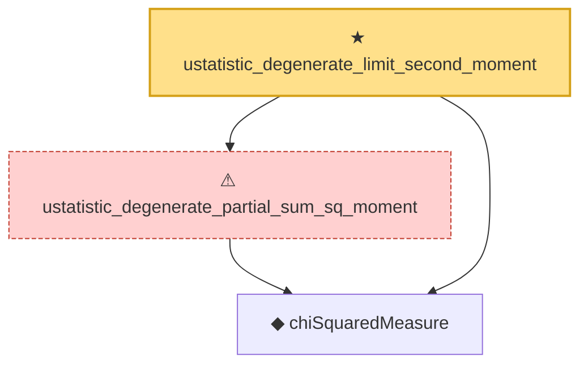

# Proof narrative — ustatistic_degenerate_limit_second_moment

Root: **ustatistic_degenerate_limit_second_moment** (theorem) `Statlib/Variance/ustatistic_degenerate_limit_second_moment.lean:34` · topic `Variance`
Closure: 3 declarations across 3 files. Generated from `proof_graph.json` — no files were moved.

Reading order (foundations first, headline last):

  ◆ `chiSquaredMeasure` — def · `Statlib/Distribution/chiSquaredMeasure.lean:15`  _(also used by 1: isProbabilityMeasure_chiSquared)_
  ⚠ `ustatistic_degenerate_partial_sum_sq_moment` — axiom · `Statlib/Variance/ustatistic_degenerate_partial_sum_sq_moment.lean:33`
★ `ustatistic_degenerate_limit_second_moment` — theorem · `Statlib/Variance/ustatistic_degenerate_limit_second_moment.lean:34` **← headline**

## Dependency diagram

