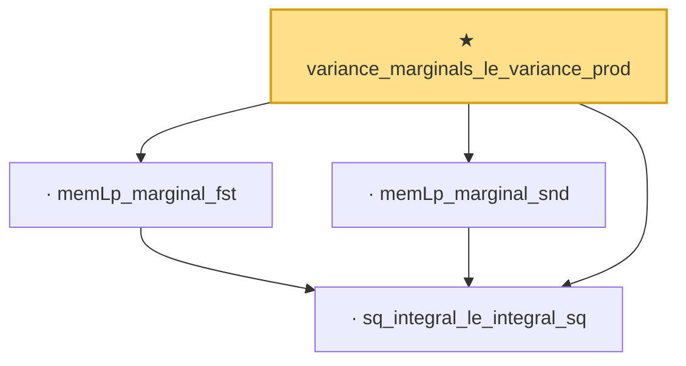

# Proof narrative — variance_marginals_le_variance_prod

Root: **variance_marginals_le_variance_prod** (theorem) `Statlib/Variance/variance_marginals_le_variance_prod.lean:22` · topic `Variance`
Closure: 4 declarations across 4 files. Generated from `proof_graph.json` — no files were moved.

Reading order (foundations first, headline last):

  · `sq_integral_le_integral_sq` — lemma · `Statlib/Variance/sq_integral_le_integral_sq.lean:19`
  · `memLp_marginal_fst` — lemma · `Statlib/Variance/memLp_marginal_fst.lean:20`
  · `memLp_marginal_snd` — lemma · `Statlib/Variance/memLp_marginal_snd.lean:20`
★ `variance_marginals_le_variance_prod` — theorem · `Statlib/Variance/variance_marginals_le_variance_prod.lean:22` **← headline**

## Dependency diagram

