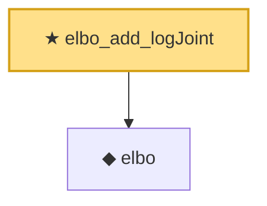

# Proof narrative — elbo_add_logJoint

Root: **elbo_add_logJoint** (theorem) `Statlib/VariationalInference/elbo_add_logJoint.lean:12` · topic `VariationalInference`
Closure: 2 declarations across 2 files. Generated from `proof_graph.json` — no files were moved.

Reading order (foundations first, headline last):

  ◆ `elbo` — noncomputable def · `Statlib/VariationalInference/elbo.lean:19`  _(also used by 4: elbo_const_smul_logJoint, elbo_self, elbo_sub_elbo, …)_
★ `elbo_add_logJoint` — theorem · `Statlib/VariationalInference/elbo_add_logJoint.lean:12` **← headline**

## Dependency diagram

