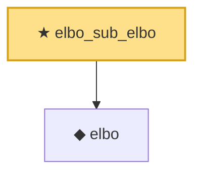

# Proof narrative — elbo_sub_elbo

Root: **elbo_sub_elbo** (theorem) `Statlib/VariationalInference/elbo_sub_elbo.lean:13` · topic `VariationalInference`
Closure: 2 declarations across 2 files. Generated from `proof_graph.json` — no files were moved.

Reading order (foundations first, headline last):

  ◆ `elbo` — noncomputable def · `Statlib/VariationalInference/elbo.lean:19`  _(also used by 4: elbo_add_logJoint, elbo_const_smul_logJoint, elbo_self, …)_
★ `elbo_sub_elbo` — theorem · `Statlib/VariationalInference/elbo_sub_elbo.lean:13` **← headline**

## Dependency diagram

