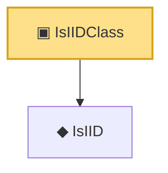

# Proof narrative — IsIIDClass

Root: **IsIIDClass** (class) `Statlib/Vocabulary/IsIIDClass.lean:23` · topic `Vocabulary`
Closure: 2 declarations across 2 files. Generated from `proof_graph.json` — no files were moved.

Reading order (foundations first, headline last):

  ◆ `IsIID` — def · `Statlib/Vocabulary/Independence.lean:15`
▣ `IsIIDClass` — class · `Statlib/Vocabulary/IsIIDClass.lean:23` **← headline**

## Dependency diagram

