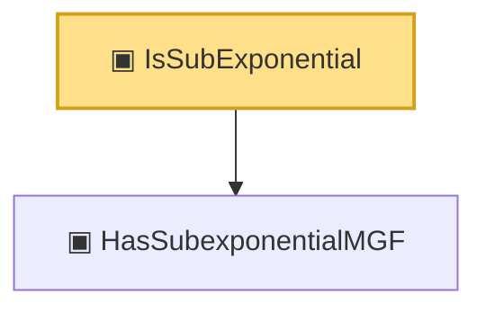

# Proof narrative — IsSubExponential

Root: **IsSubExponential** (class) `Statlib/Vocabulary/IsSubExponential.lean:28` · topic `Vocabulary`
Closure: 2 declarations across 2 files. Generated from `proof_graph.json` — no files were moved.

Reading order (foundations first, headline last):

  ▣ `HasSubexponentialMGF` — structure · `Statlib/Vocabulary/RandomVariable.lean:74`  _(also used by 10: bernstein_sum_meas_abs_ge_le_two_exp, bernstein_sum_meas_ge_le_exp, subexp_max_meas_ge_le_exp, …)_
▣ `IsSubExponential` — class · `Statlib/Vocabulary/IsSubExponential.lean:28` **← headline**

## Dependency diagram

